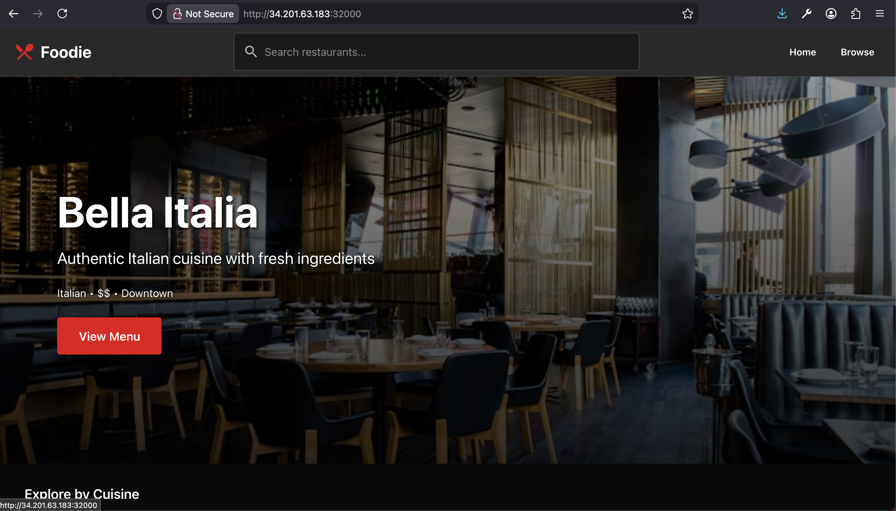
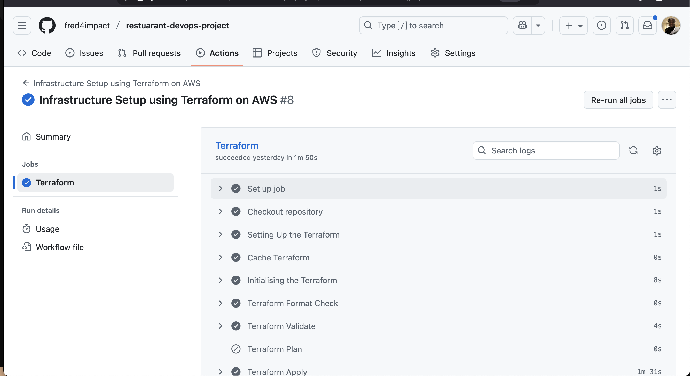
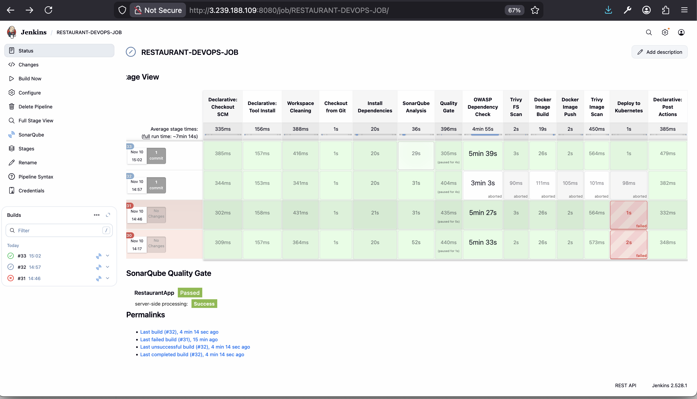
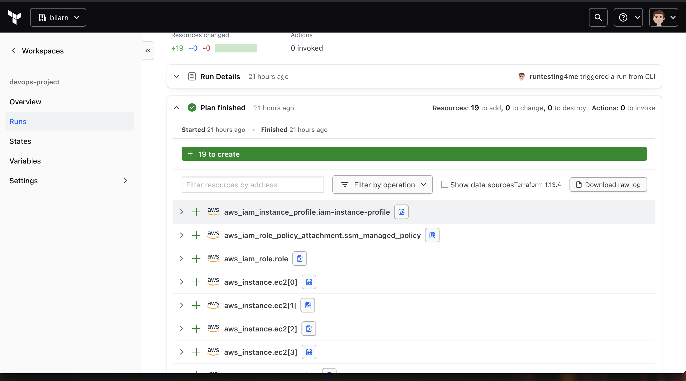

# Restaurant DevOps Project

A DevOps project showcasing CI/CD practices, infrastructure as code, security scanning, and container orchestration for a Restaurant Discovery application.

## 🏗️ DevOps Components

- **Infrastructure as Code** - Terraform for AWS infrastructure (VPC, EC2, Jenkins, Prometheus, K8s)
- **CI/CD Pipeline** - Jenkins with automated builds, security scans, and deployments
- **Security Scanning** - SonarQube, OWASP Dependency Check, Trivy
- **Containerization** - Docker with multi-stage builds
- **Container Orchestration** - Kubernetes deployment
- **Infrastructure Automation** - GitHub Actions for Terraform workflows
- **Monitoring** - Prometheus for metrics collection

## 📸 Project Visual Overview



### GitHub Actions


### Jenkins Pipeline


### Terraform Infrastructure


### Kubernetes Deployment


## 📁 Project Structure

```
├── Restaurant-app/          # React/TypeScript application
├── Terraform/               # Infrastructure as Code
├── Jenkins/                 # CI/CD pipeline (Jenkinsfile)
├── k8s/                     # Kubernetes manifests
└── .github/workflows/       # GitHub Actions workflows
```

## 🚀 CI/CD Pipeline (Jenkins)

**Pipeline Stages:**
1. Workspace Cleaning → 2. Git Checkout → 3. Install Dependencies
4. SonarQube Analysis → 5. Quality Gate → 6. OWASP Dependency Check
7. Trivy Filesystem Scan → 8. Docker Build → 9. Docker Push
10. Trivy Image Scan → 11. Deploy to Kubernetes → 12. Slack Notification

## 🛠️ Prerequisites

- AWS Account with IAM permissions
- Terraform (v1.13.3+)
- Jenkins with plugins (SonarQube, OWASP, Docker, Kubernetes, Slack)
- Docker & Kubernetes cluster access
- Node.js

## 🔧 Quick Setup

### Infrastructure (Terraform)
```bash
cd Terraform
terraform init
terraform plan
terraform apply
```

**GitHub Secrets Required:**
- `TF_API_TOKEN`, `TF_WORKSPACE`, `TF_CLOUD_ORGANIZATION`

### Jenkins Configuration
1. Install required plugins
2. Configure credentials (Docker, K8s, SonarQube, Slack)
3. Create pipeline job pointing to `Jenkins/Jenkinsfile`

## 🔐 Security

- ✅ SonarQube code quality gates
- ✅ OWASP dependency vulnerability scanning
- ✅ Trivy filesystem & container image scanning
- ✅ Automated security checks in CI/CD pipeline

## 🚦 Workflow

```
Code Push → Jenkins Pipeline → Security Scans → Docker Build → 
K8s Deployment → Slack Notification
```

## 📚 Documentation

See `Restaurant-app/docs/` for detailed setup guides:
- `JENKINS_SETUP.md` - Jenkins configuration
- `CI_CD_SETUP.md` - CI/CD details

---

**Note**: Configure credentials and URLs according to your environment.

## Links to repo